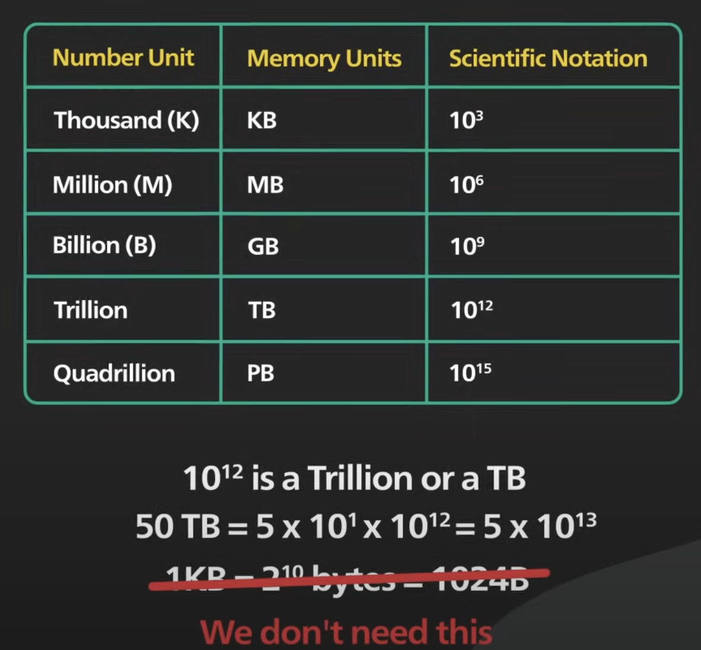

# Back Of the Envelope Estimate

## It's all about the maths we need to calculate numbers, how much we need what?

- Thought Experiments + Common performance numbers
- Which design will meet your requirements

- Power of 2
  - Volume of data
- Latency numbers
  - Memory is faster than disk
  - Avoid disk seeks if feasible
  - Compress data
- Availability numbers
  - High availability
  - SLA (Service level Agreement) Service provider and consumer

Traffic estimations:
- Total Users
- Daily active users

RAM Estimations
CAP Theorem

Steps:
1) Consider system constraints
2) Drives our decision. For ex either I should take load balancer or not.
3) Give Rough Estimation
4) Do not spend much time
5) Take examples like 10 M not 24 million for easy computation
6) Traffic Estimation

References:
- https://www.youtube.com/watch?v=UC5xf8FbdJc
- https://www.youtube.com/watch?v=WZjSFNPS9Lo
- https://www.youtube.com/watch?v=juCeZCZgWZU
  

Cheet Sheet:

